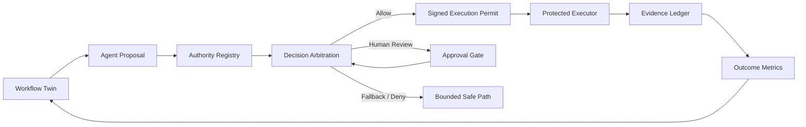

# Sentinel Governed Workflow Twin

**A public reference implementation for governed agentic workflow execution.**

[](https://github.com/Morbiaus/sentinel-governed-workflow-twin/actions/workflows/ci.yml)


Sentinel Governed Workflow Twin demonstrates a specific proposition:

> **An AI system may be capable of taking an action without being authorized to take that action.**

This repository shows how an enterprise workflow can be represented as a digital twin, redesigned with agentic AI, and executed through explicit authority checks that produce structured evidence.

It is a **public-safe reference implementation**, not the proprietary Sentinel product codebase. All examples are synthetic.

## Why this exists

Many AI demonstrations stop at model capability: the model can classify, recommend, generate, plan, or call a tool.

Enterprise deployment requires additional questions:

- Is the agent registered?
- Is the action inside its delegated authority?
- Is the requested tool permitted?
- Does the action exceed the agent's risk ceiling?
- Is human approval required?
- Is confidence sufficient for the action class?
- What happens when a decision cannot proceed?
- Can a consequential tool be invoked without passing the governance boundary?
- Can the organization reconstruct what happened afterward?
- Did the redesigned workflow actually improve cycle time, cost, quality, or control effectiveness?

This reference implementation makes those questions executable.

## Architecture



The protected executor rejects direct execution unless the action carries a valid permit issued after arbitration.

## What is implemented

- **Workflow Twin** — machine-readable workflow steps, action classes, risk, proposed autonomy, and control points.
- **Authority Registry** — declared agent action classes, tools, and risk ceilings.
- **Deterministic Arbitration** — registered identity, delegated action, tool permission, risk ceiling, confidence, approval requirement, and bounded fallback.
- **Protected Execution Gateway** — HMAC-signed permits bind authorization to the exact proposed action.
- **Evidence Ledger** — structured decision trace including action fingerprint, disposition, checks, and permit status.
- **Outcome Metrics** — baseline-to-redesign comparison for cycle time, cost units, defects, human touches, and evidence completeness.
- **Synthetic 17-step financial-services workflow** — a reproducible enterprise-style example containing low-, moderate-, and high-risk steps.
- **13 reference governance tests** — including direct-execution rejection and permit-tampering tests.
- **Continuous Integration** — GitHub Actions runs the test suite on every push and pull request.

## Quick start

```bash
git clone https://github.com/Morbiaus/sentinel-governed-workflow-twin.git
cd sentinel-governed-workflow-twin

python -m venv .venv
source .venv/bin/activate  # Windows: .venv\Scripts\activate
pip install -e ".[dev]"

pytest -q
python -m sentinel_ref.cli
```

## Repository map

```text
sentinel-governed-workflow-twin/
├── sentinel_ref/
│   ├── models.py
│   ├── authority.py
│   ├── arbitration.py
│   ├── gateway.py
│   ├── evidence.py
│   ├── metrics.py
│   └── cli.py
├── examples/
│   └── synthetic_bank_workflow.json
├── benchmarks/
│   ├── baseline.json
│   ├── governed_redesign.json
│   └── results.md
├── schemas/
│   ├── workflow.schema.json
│   └── evidence.schema.json
├── docs/
│   ├── ARCHITECTURE.md
│   ├── capability-vs-authority.md
│   ├── evidence-model.md
│   └── framework-alignment.md
├── tests/
├── .github/workflows/ci.yml
└── SECURITY.md
```

## A concrete example

A synthetic workflow agent proposes a consequential state change.

1. The agent can generate the action.
2. The action is classified as **HIGH** risk.
3. The authority registry confirms the agent may propose that action.
4. The approved-tool registry confirms the tool is known.
5. The arbitration engine determines human approval is required.
6. No execution permit is issued until approval is present.
7. The protected executor rejects any direct call that lacks a valid permit.
8. The final decision and control trace are written to the evidence ledger.

The difference between **capability** and **authority** is therefore represented in code, not only policy language.

## Synthetic benchmark

The included benchmark is deliberately illustrative and does **not** represent a client or employer process.

| Metric | Baseline | Governed redesign |
|---|---:|---:|
| Cycle time | 960 min | 190 min |
| Cost units | 100 | 36 |
| Quality defects | 7.5% | 2.0% |
| Human touches | 17 | 6 |
| Decision-evidence completeness | 45% | 100% |

The important design requirement is not the particular numbers. It is that an AI workflow redesign should declare which outcomes it expects to improve and preserve evidence sufficient to test the claim.

## Framework alignment

The repository contains implementation-oriented alignment notes for:

- **NIST AI Risk Management Framework (AI RMF) 1.0** and the Generative AI Profile
- **MITRE ATLAS** adversarial threat knowledge base for AI systems
- **OWASP Top 10 for Agentic Applications 2026**

The alignment notes are not compliance claims. They show where Sentinel reference controls address related governance and security concerns.

## Security boundary

This repository demonstrates the **application-layer pattern** for non-bypassable authorization by requiring a signed execution permit.

A production-grade boundary should add stronger isolation appropriate to the deployment environment—for example separate-process policy enforcement, workload identity, operating-system sandboxing, least-privilege tool credentials, network policy, or equivalent controls. The public reference implementation intentionally does not expose private Sentinel enforcement code.

## Design principles

1. **Capability does not confer authority.**
2. **Every consequential action should have a declared decision path.**
3. **Authority should be narrower than capability.**
4. **Fallback behavior should be designed before failure occurs.**
5. **Human approval should be explicit and testable.**
6. **Governance decisions should emit evidence.**
7. **Workflow transformation should be measured against a baseline.**

## Author

**Juan A. Martinez Diaz, MBA**  
AI Governance • Agentic Systems • Workflow Intelligence • Operational Risk  
[juanmartinez.ai](https://www.juanmartinez.ai)

## License

MIT License. See [LICENSE](LICENSE).
